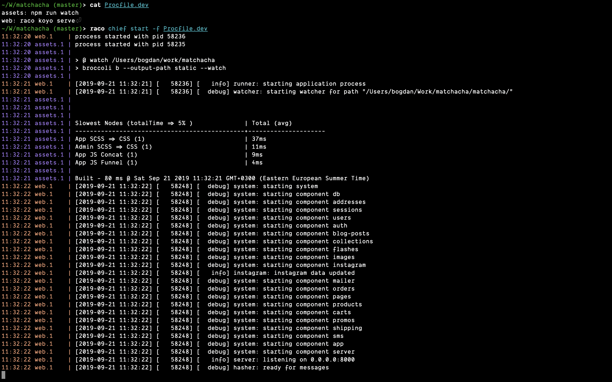

# chief

Chief is a port of [foreman] to Racket.  It runs sets of processes
together based on a `Procfile`.



## Getting Started

You can install `chief` from the package server by running:

    $ raco pkg install chief

## Usage

Create a `Procfile`:

```procfile
assets: npm start
web: raco koyo serve
redis: redis-server --port $PORT
```

Run the processes:

    $ raco chief start

Chief will automatically load environment variables from a `.env` file
located in the current directory.  Additional `.env` files can be
specified using the `-e` flag:

    $ raco chief start -e env-file-1 -e env-file-2

Different procfiles can be specified using the `-f` flag:

    $ raco chief start -f Procfile.dev

You can run arbitrarily many processes of each type using the `-m`
flag:

    $ raco chief start -m web=1 -m redis=3

Every process type is assigned a range of 100 ports, beginning with
port `5000`, and every instance of a process type gets assigned one of
those ports via the `PORT` environment variable.  In the example
above, the `assets` proces would have its `PORT` environment variable
set to `5000`, the `web` process would have its `PORT` set to `5100`,
and the `redis` processes would have their `PORT`s set to `5200`,
`5201` and `5202`, respectively.

## Differences from `foreman`

* The `export` command is not supported.
* The `-e` flag can be passed multiple times.
* The `-m` flag can be passed multiple times.


[foreman]: http://ddollar.github.io/foreman/
